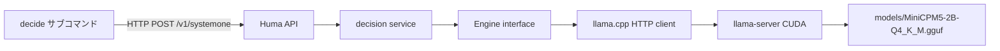

# 000 Decision Model プロトタイプ (`features/decision-test`)

調査根拠: `tmp/investigate/decision-test-report.md`（調査ワークフローの成果。リポジトリにはコミットしない）。

## 背景 (Background)

ブラウザだけで動作する [SemIf (openjev.com)](https://openjev.com/) は、ローカル GGUF モデルに対して次の 2 方式を同じ決定入力で実行し、差分を測る。

- **read logits**: 選択肢ラベル A…T の次トークン logprob を 1 回のフォワードパスで読み、ラベル間だけで softmax して確率にする。デコードしない。
- **write tokens**: 同じ分布を `{options + probabilities}` の JSON としてトークン生成する。

推論は [wllama](https://github.com/ngxson/wllama) v3 経由である。wllama v3 は llama.cpp `llama-server` の推論部 `server-context` を WebAssembly 化したものであり、ブラウザ（Web Worker / SharedArrayBuffer / WebGPU）専用で、Go サーバからは直接使えない。同じリクエストはネイティブ `llama-server` の `POST /v1/chat/completions` にそのまま渡せる。

本リポジトリはスキャフォールド直後で、`features/decision-test/` は空である。Decision Model のプロトタイプを、CLI と Huma の Web API としてここに置く。公開 API の形は [Jev Playground](https://www.jevai.org/docs) の System One（`state` + 型付き `questions`、`answers` に確率と confidence）に合わせる。モデルは [openbmb/MiniCPM5-2B-GGUF](https://huggingface.co/openbmb/MiniCPM5-2B-GGUF) の Q4_K_M（1.56 GB）を、openjev と同じリビジョン `2079a22f3beaa4e306449978533478fe0522f4b3` で事前ダウンロードする。

対象マシンは Windows、NVIDIA GeForce RTX 3070 Laptop（8 GB VRAM）。Q4_K_M と `n_ctx=2048` はこの VRAM に収まる。`llama-server` は未導入である。

## 要件 (Requirements)

### 必須要件

1. **単一バイナリ**
   - `features/decision-test` は独立した Go モジュールとする。
   - CLI と API サーバは 1 つの `main` パッケージにまとめる。`scripts/process/build.sh` は `go build -o bin/<feature> ./...` を使うため、`main` が 2 つあるとビルドできない。
   - 引数なし（または `serve`）で API サーバを起動し、`decide` サブコマンドで決定を実行する。

2. **Huma API**
   - OpenAPI 3.1 の Huma で次を提供する。
   - `POST /v1/systemone`: 決定の実行。
   - `GET /health`: `llama-server` への到達、ロード中モデル名、ラベル A…T のトークン ID 解決結果。
   - 不正入力は HTTP 422。推論エンジンの失敗は HTTP 502。本文は Huma のエラー形式に従う。

3. **リクエスト形状（Jev 準拠）**

   ```json
   {
     "model": "minicpm5-2b-q4_k_m",
     "state": "A customer says a password reset succeeded, but every login attempt still returns 'account locked'. Two unlock emails were requested and neither arrived.",
     "questions": {
       "queue": {
         "type": "choice",
         "instructions": "Which queue should handle this request?",
         "criteria": {
           "account_access": "Account access support",
           "billing": "Billing support",
           "close": "Close as resolved"
         }
       }
     },
     "options": { "method": "both" }
   }
   ```

   - `state`: 文字列、オブジェクト、配列。オブジェクトと配列は JSON 文字列化してプロンプトに埋め込む。空は 422。
   - `questions`: 質問 ID から質問へのマップ。1 件以上。質問 ID はモデルに渡さない。意味は `instructions` に書く。
   - `type`: 本仕様の必須範囲は `choice` のみ。`score` と `noul` は 422 とし、エラー文で未対応であることを示す。
   - `criteria`（choice）: option key から説明文字列（または null）へのオブジェクト。2 個以上 20 個以下。空の key、重複、空文字の説明以外の欠落は 422。説明が null のときは option key だけを選択肢本文にする。
   - `model`: 省略可。省略時はサーバ設定のモデル ID を使い、レスポンスには実際に使った ID を返す。未知の ID は 422。
   - `options.method`: `direct` | `generation` | `both`。省略時は `direct`。

4. **レスポンス形状（Jev 準拠 + 比較拡張）**

   ```json
   {
     "model": "minicpm5-2b-q4_k_m",
     "answers": {
       "queue": {
         "type": "choice",
         "choice": "account_access",
         "probabilities": {
           "account_access": 0.91,
           "billing": 0.03,
           "close": 0.06
         },
         "confidence": 0.71,
         "method": "direct"
       }
     },
     "usage": { "input_tokens": 212, "output_tokens": 1 },
     "elapsedMs": 140
   }
   ```

   - `answers` のキーはリクエストの質問 ID と一致する。
   - `probabilities` のキーは `criteria` の option key と一致し、値は 0 以上 1 以下、合計は 1（浮動小数の誤差を除く）。
   - `choice` は確率最大の option key。同率のときは `criteria` の出現順で先の key。
   - `confidence` は分布の集中度で、`1 - H(p) / ln(n)`。`H` は自然対数のエントロピー、`n` は選択肢数。1 点集中で 1、一様分布で 0。OpenAPI の説明にこの定義を書く。Jev の非公開定義とは一致しない。
   - `usage.input_tokens` / `output_tokens` は llama-server が返した値の、質問と方式をまたいだ合計。
   - `elapsedMs` はハンドラ入口から応答組み立てまで（検証を含む）。純粋な推論時間ではない。
   - `method` が `generation` または `both` のとき、各 answer に次を付ける。`direct` のときは付けない。

   ```json
   "generation": {
     "choice": "account_access",
     "probabilities": { "account_access": 0.85, "billing": 0.05, "close": 0.10 },
     "valid": true,
     "validation_error": "",
     "generated_text": "{...}",
     "ttft_ms": 120.4,
     "total_ms": 2310.7,
     "output_tokens": 61
   },
   "timings": { "direct_ms": 95.2, "generation_ms": 2310.7, "ratio": 24.27 }
   ```

   - `method: generation` のとき、トップレベルの `choice` / `probabilities` / `confidence` は生成結果から作る。`valid: false` のときはトップレベルの `choice` を空にし、`probabilities` を付けず、HTTP ステータスは 200 のまま `generation.valid` と `validation_error` で失敗を表す（モデル出力の検証失敗はクライアントエラーではない）。
   - `method: both` のとき、トップレベルの `choice` / `probabilities` / `confidence` は **direct（read logits）を正** とする。`timings.ratio` は `generation_ms / direct_ms`。
   - `method: direct` のとき `timings.direct_ms` のみを付ける。

5. **read logits（direct）**
   - 1 質問につき 1 回のチャット補完。`max_tokens` は 1。
   - サンプリングは openjev に合わせる: `temperature: 1`, `top_k: 0`, `top_p: 1`, `logprobs: true`。
   - `top_logprobs` は `max(64, 4 * 選択肢数)`。openjev の 20 固定は採用しない。
   - 返却された `top_logprobs` から、各ラベルに対応するトークン ID の logprob を取り、**そのラベル集合だけで softmax** する。全語彙 softmax の値をそのまま返さない。
   - ラベルが 1 つでも欠ける場合は 502 とし、欠けたラベルをエラーに含める。
   - 生成される 1 トークンをラベルに固定するため、GBNF `root ::= "A" | "B" | ...` と、各ラベルトークンへの `logit_bias` +100 を付ける。これはサンプル結果の固定であり、pre-sampling の `top_logprobs`（生 logits の softmax）には影響しない。確率計算は `top_logprobs` 側を使う。
   - `chat_template_kwargs.enable_thinking` は `false`。

6. **write tokens（generation）**
   - ストリーミングのチャット補完。`max_tokens: 512`, `temperature: 0`, `cache_prompt: false`, `enable_thinking: false`。
   - 最初の非空 `delta.content` の到着時刻を `ttft_ms` とする。
   - 生成テキストの検証は openjev の `validateGeneration` と同じ規則にする。
     1. 先頭の `<think>...</think>` を除去する。
     2. 残りを JSON オブジェクトとして解析する。配列やスカラーは不可。
     3. キー集合が、選択肢の出現順に作った `"<label>: <option text>"` と完全一致する。過不足は不可。
     4. 各値は 0 以上 1 以下の有限な数値。
     5. 合計が 1 ± 0.02。
     6. 最大値のラベルを `choice` にする。
   - 検証失敗時は例外で落とさず、`valid: false` と理由文字列を返す。

7. **プロンプト**
   - system: `Make the requested decision from the supplied state. Follow the output format exactly.`
   - user は `State:`、`Question:`（`instructions`）、`Allowed options:`、出力指示の順。
   - 選択肢行は `A. <option text>`。説明があるときは option text を `<key>: <description>` とし、null のときは `<key>` のみとする。ラベルは A から出現順。
   - direct の出力指示: `Reply with exactly one option letter from: A, B, C.`（実際のラベル列）。
   - generation の出力指示: 各選択肢の確率を推定し、キー `"<label>: <full option text>"` の JSON オブジェクトだけを返す。例示、全キーを順に 1 回、値は 0 から 1、合計 1、markdown と説明の禁止。文言は openjev の `worker.js` に合わせ、例示の "Route north" / "Route south" は固定の例として残す。
   - 1 リクエスト内の複数質問は、同じ `state` で質問ごとに順に実行する。質問間で GPU を奪い合わない。

8. **モデルと llama-server**
   - モデルファイルは `models/MiniCPM5-2B-Q4_K_M.gguf`。取得 URL はリビジョン固定とする。

     `https://huggingface.co/openbmb/MiniCPM5-2B-GGUF/resolve/2079a22f3beaa4e306449978533478fe0522f4b3/MiniCPM5-2B-Q4_K_M.gguf`

   - 取得と `llama-server` の導入・起動は `scripts/setup/` の bash スクリプトにする。各スクリプトは `--help` を持つ。
   - Windows x64 では llama.cpp ビルド `b11056` の `llama-b11056-bin-win-cuda-12.4-x64.zip` と `cudart-llama-bin-win-cuda-12.4-x64.zip` を使う。展開先とバイナリのビルド番号は `settings/decision-test.yaml` に書く。
   - 起動引数: `-m <model> -c 2048 -b 512 -ngl 99 -np 1 --jinja --host 127.0.0.1`。ポートは設定ファイル。思考の無効化はリクエストの `chat_template_kwargs` で行い、サーバ全体の `--reasoning off` には依存しない。
   - 起動後、`Reply with the single word ready.` を `max_tokens: 1`, `temperature: 0` で 1 回送り、ウォームアップが応答を返すまで `/health` は未準備を返す。
   - ラベル A…T のトークン ID は起動時に `POST /tokenize`（`with_pieces: true`）で解決する。各ラベルが単一トークンであることを検証し、そうでなければ起動を失敗させる。`labelBase` のハードコードはしない。
   - Go から llama-server への推論呼び出しはミューテックスで直列化する。
   - モデルファイルと llama.cpp バイナリは Git に入れない。

9. **CLI**
   - `decide --input <json> [--server URL] [--method direct|generation|both] [--json]`。
   - `--input` の JSON は `POST /v1/systemone` のボディと同じ。`--method` はボディの `options.method` を上書きする。
   - `--json` のときはレスポンス JSON をそのまま標準出力へ出す。付けないときは、質問ごとに `choice`、`confidence`、option key と確率、direct / generation の時間と ratio を人間可読に出す。
   - 接続先の既定は設定ファイルの API URL。
   - 検証用入力を `features/decision-test/testdata/account.json` と `features/decision-test/testdata/email.json` に置く。内容は openjev の 2 プリセットを本仕様のリクエスト形に変換したもの（下の検証シナリオ 2 と 3）。

10. **設定とログ**
    - ポート、llama-server の URL、バイナリパス、モデルパス、モデル ID は `settings/decision-test.yaml`。コードにホストやポートをハードコードしない。
    - ログは feature 内の `internal/logger` だけを使う。`log`、`fmt.Print`、`slog` の直接使用は禁止。コンポーネントタグは `decision`。フィールド名はスネークケース。
    - ソースのコメントと識別子は英語。

11. **推論エンジンの境界**
    - llama-server 呼び出しは `Engine` インターフェースの背後に置く。メソッドは、ラベル logprob の読み取り、JSON 生成、疎通確認に限る（1 から 3 個）。
    - 本仕様の実装は llama-server HTTP クライアントのみ。別実装への差し替えを妨げないこと。

### 任意要件（本仕様では実装しない）

- `score`（2〜10 段階、確率加重平均）と `noul`（yes 確率）。どちらも同じラベル readout に還元できるが、choice の完了後に別仕様とする。
- 255 選択肢。単一トークンラベル A…T では 20 が上限。
- レスポンスの SSE ストリーミング。
- yzma 等によるプロセス内バインディング。`Engine` の差し替え先として残すだけにする。
- Ollama / LM Studio バックエンド。`logprobs`、`grammar`、`logit_bias`、`chat_template_kwargs` を openjev と同じ形で渡せないため不採用。

## 実現方針 (Implementation Approach)



`features/decision-test` のパッケージ分割:

| パス | 役割 |
| --- | --- |
| `features/decision-test/cmd/decision-test/main.go` | humacli。既定はサーバ起動。`decide` を cobra サブコマンドとして追加 |
| `features/decision-test/internal/logger` | 統一ロガー |
| `features/decision-test/internal/config` | `settings/decision-test.yaml` の読み込み |
| `features/decision-test/internal/domain` | リクエストと応答の型 |
| `features/decision-test/internal/prompt` | openjev と同じメッセージ構築とラベル割り当て |
| `features/decision-test/internal/decision` | softmax、confidence、logprob 抽出、生成 JSON 検証、2 方式の順次実行 |
| `features/decision-test/internal/engine` | `Engine` と llama-server クライアント |
| `features/decision-test/internal/api` | Huma オペレーション |
| `features/decision-test/internal/cli` | `decide` の入出力 |
| `scripts/setup/install_llama_cpp.sh` | CUDA 12.4 向け zip の取得と展開 |
| `scripts/setup/download_model.sh` | リビジョン固定 URL からの GGUF 取得 |
| `scripts/setup/run_llama_server.sh` | 上記引数での起動 |
| `tests/decision_systemone_test.go` | 統合テスト。`tests/go.mod` を新設する |

処理順は openjev と同じく direct のあと generation。`cache_prompt` は false。

`logit_bias` と grammar は「サンプルされる 1 トークンをラベルにする」ために残す。確率は pre-sampling の `top_logprobs` をラベル ID で引いて softmax する。ID は `/tokenize` の結果を使う。

## 検証シナリオ (Verification Scenarios)

### 1. 環境とヘルス

1. `scripts/setup/install_llama_cpp.sh` を実行し、設定ファイルのパスに `llama-server` が展開される。
2. `scripts/setup/download_model.sh` を実行し、`models/MiniCPM5-2B-Q4_K_M.gguf` が存在する。
3. `scripts/setup/run_llama_server.sh` を実行し、llama-server の `/health` が成功する。
4. `bin/decision-test` を起動する。ウォームアップ完了後、`GET /health` がモデル ID `minicpm5-2b-q4_k_m` と、A…T がそれぞれ単一トークンである ID マップを返す。

### 2. read logits（account プリセット）

入力 `features/decision-test/testdata/account.json`:

- state: `A customer says a password reset succeeded, but every login attempt still returns ‘account locked’. Two unlock emails were requested and neither arrived.`
- instructions: `Which queue should handle this request?`
- criteria: `account_access` = `Account access support`、`billing` = `Billing support`、`close` = `Close as resolved`

1. `bin/decision-test decide --input features/decision-test/testdata/account.json --method direct --json` を実行する。
2. HTTP 200。`answers.queue.type` は `choice`。`answers.queue.choice` は 3 つの key のいずれか。
3. `probabilities` の 3 つの値は 0 以上 1 以下で、合計が 1 ± 1e-6。
4. `confidence` は 0 以上 1 以下。
5. `usage.output_tokens` は 1（readout は 1 トークン）。
6. `generation` フィールドは無い。`timings.direct_ms` が 0 より大きい。

### 3. write tokens（email プリセット）

入力 `features/decision-test/testdata/email.json`:

- state: `An email claims to be from the payroll team and says the recipient’s salary payment will be suspended today. It comes from payroll-review@outlook.com and links to a non-company sign-in page asking for a password and verification code.`
- instructions: `How should this email be classified?`
- 質問 ID: `classification`
- criteria: `legitimate` = `Legitimate`、`spam` = `Spam`、`phishing` = `Phishing`

1. `decide --input features/decision-test/testdata/email.json --method generation --json` を実行する。
2. `answers.classification.generation.valid` が true。`generated_text` は JSON オブジェクトで、キーが `A: legitimate: Legitimate`、`B: spam: Spam`、`C: phishing: Phishing` と一致する。
3. 生成確率の合計が 1 ± 0.02。トップレベルの `choice` がその argmax と一致する。
4. `ttft_ms` と `total_ms` が 0 より大きく、`ttft_ms` が `total_ms` 以下。

### 4. 両方式の順次実行

1. account 入力で `--method both` を実行する。
2. トップレベルの `probabilities` は direct の値である（generation の値と別に `generation.probabilities` がある）。
3. `timings.ratio` が `generation_ms / direct_ms` と一致する（表示桁の誤差を除く）。
4. サーバログに、direct の完了後に generation を開始した順序が DEBUG で残る。

### 5. 入力検証

1. criteria が 1 個の JSON を POST し、422 が返る。
2. criteria が 21 個の JSON を POST し、422 が返る。
3. `type: score` を POST し、422 と未対応である旨が返る。
4. `state` が空文字の JSON を POST し、422 が返る。
5. 上記のいずれでも llama-server へ推論リクエストが送られない。

### 6. 人間可読 CLI

1. `--json` なしで account を `--method both` 実行する。
2. 標準出力に `account_access`、`billing`、`close` の確率と、direct 時間、generation 時間、ratio が含まれる。
3. 終了コードは 0。`--json` の出力を機械判定するテストとは別に、この整形を単体テストで固定する。

## テスト項目 (Testing for the Requirements)

単体テストは外部通信をしない。llama-server は `httptest` のフィクスチャで置き換える。統合テストだけが実モデルを使う。`t.Skip` は禁止。llama-server やモデルが無い統合テストは `t.Fatal` で落とす。

| 要件 | テスト |
| --- | --- |
| 7 プロンプト | `internal/prompt` のゴールデンテスト。direct / generation、説明 null、オブジェクト state の文字列化 |
| 5 softmax と欠落 | `internal/decision`。フィクスチャの `top_logprobs` から option key 確率が再現できること。ラベル欠落でエラーになること |
| 4 confidence | 一様分布で 0、1 点集中で 1、定義式と一致すること |
| 6 生成検証 | 正常 JSON、`<think>` 除去、キー過不足、合計が 0.02 を超える、非数値。失敗はエラー返却ではなく `valid: false` |
| 11 Engine | `httptest` で、送った JSON に `top_logprobs`、`logit_bias`、`grammar`、`chat_template_kwargs.enable_thinking=false`、`cache_prompt=false` が含まれること。SSE から TTFT と usage を取れること |
| 2, 3, 4 API | `humatest` で 200 の形、422（シナリオ 5 の 1〜4）、502（ラベル欠落フィクスチャ） |
| 9 CLI | `--json` と人間可読出力の単体テスト |
| 1 単一バイナリ | `scripts/process/build.sh` が `bin/decision-test` を出力すること |
| 8, シナリオ 1〜4 | `tests/decision_systemone_test.go`（`//go:build integration`） |

### ビルド・全体検証

このリポジトリの `scripts/process/integration_test.sh` は `--categories` を持たない。絞り込みは `--specify` のみ。

1. ビルドと単体テスト:

```bash
./scripts/process/build.sh
```

2. Decision Model の統合テスト（実 llama-server と MiniCPM5。事前にシナリオ 1 の 1〜3 を完了していること）:

```bash
./scripts/process/integration_test.sh --specify "TestDecisionSystemOne"
```

3. 入力検証と CLI 整形の再確認（単体テストに含まれるため、名前を指定してビルドスクリプト経由でよい。開発中にパッケージを絞る必要がある場合も `go test` の直接実行はせず、上記 1 を使う）:

```bash
./scripts/process/build.sh
```

全カテゴリ一括の統合テストはこのリポジトリでは未整備であり、本仕様の完了条件に含めない。
