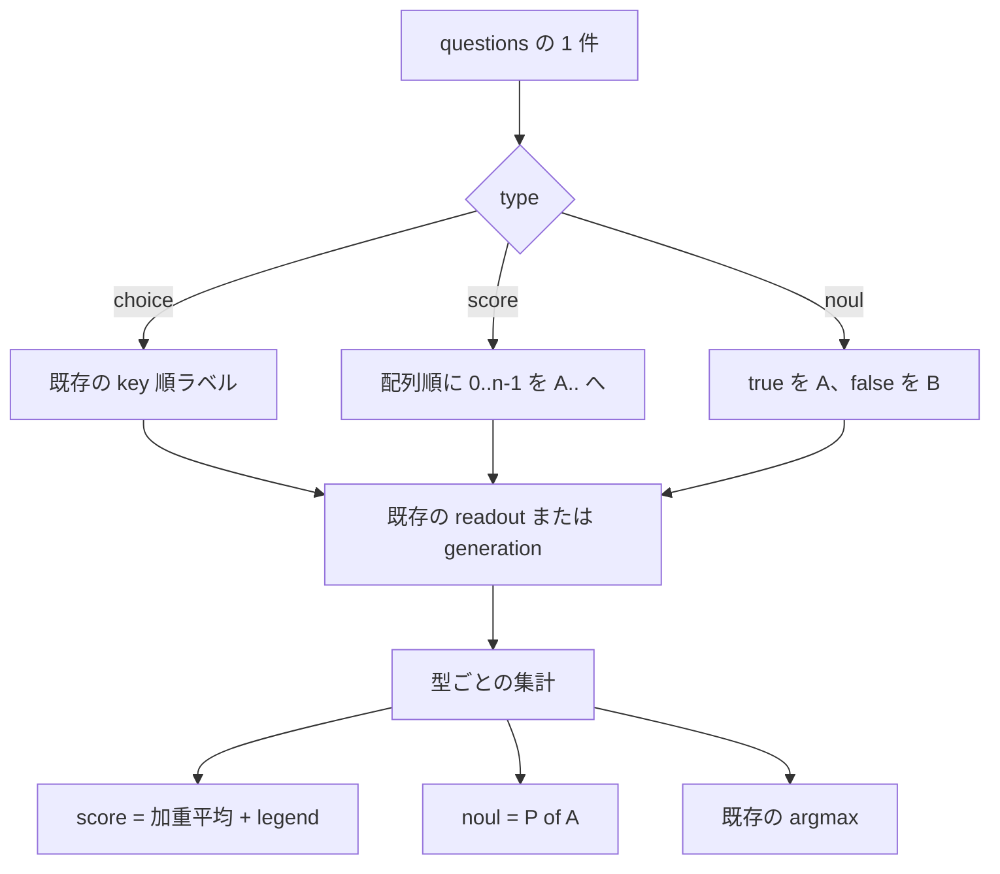

# 001 Score と Noul

先行仕様: `prompts/phases/000-foundation/branches/main/ideas/000-DecisionTest.md`

公開形の根拠: [Jev Playground](https://www.jevai.org/docs)、[Cloudflare AI の Jev 例](https://developers.cloudflare.com/ai/models/typesafe/jev/)

## 背景 (Background)

`000-DecisionTest` は `POST /v1/systemone` の `type: choice` だけを実装した。同じドキュメントが定義する残り 2 型は、入力検証で 422（未対応）になる。

- **score**: 低い方から高い方へ並んだ 2〜10 段階。返り値は段階番号の確率加重平均で、段階のあいだに落ちてよい。
- **noul**: yes の確率。真偽の二択であり、別の confidence は返さない。

どちらも「固定ラベル上の 1 回の読み出し」に還元できる。新しい推論エンジンやエンドポイントは要らない。choice の A…T readout と、同じ生成検証を、型ごとのラベル割り当てと集計に差し替える。

## 要件 (Requirements)

### 必須要件

1. **対象と非対象**
   - 変更先は既存の `features/decision-test` のみ。バイナリ、`POST /v1/systemone`、`GET /health`、`decide`、`settings/decision-test.yaml`、llama-server の起動方法は `000-DecisionTest` のまま。
   - `type: choice` の入出力、プロンプト、422、502 は変えない。
   - `000-DecisionTest` が「`score` と `noul` は 422」と書いた部分は、本仕様で置き換える。この 2 型を未対応として拒否してはならない。
   - 255 選択肢、レスポンス SSE、プロセス内バインディング、Ollama / LM Studio は引き続きやらない。

2. **共通**
   - 1 リクエストに `choice`、`score`、`noul` を混ぜてよい。質問 ID の出現順に、同じ `state` で 1 問ずつ実行する。
   - 質問 ID はモデルに渡さない。`instructions` は choice と同じく、空でない文字列。オブジェクトや配列の `instructions` は本仕様でも受けない（422）。
   - `options.method` は `direct` | `generation` | `both`。省略時は `direct`。質問ごとではなくリクエスト全体に 1 つ。
   - `method: direct` のトップレベル値はラベル readout。`method: generation` のトップレベル値は、検証に通った生成分布。`valid: false` のときは HTTP 200 のまま、その質問の決定値（`score` または `noul`）と `probabilities` と `confidence` を付けない。`method: both` のトップレベル値は direct を正とし、`generation` に生成側を残す。`timings` の規則は choice と同じ（`ratio` は `generation_ms / direct_ms`）。
   - readout のサンプリング、`top_logprobs = max(64, 4 * ラベル数)`、ラベル集合だけの softmax、欠落ラベルの 502、GBNF と `logit_bias`、`enable_thinking: false` は choice と同じ。使うラベルは A から必要個数だけ。
   - `confidence` の定義は choice と同じ `1 - H(p) / ln(n)`。OpenAPI の説明も同じ文を維持する。Jev の非公開定義には合わせない。
   - `elapsedMs` はハンドラ入口から、検証と全質問の実行が終わるまで。推論エンジンは埋めない。

3. **score の入力**
   - `criteria` は文字列の配列。2 個以上 10 個以下。並びは低い段階から高い段階。段階番号は 0 始まり（3 段階なら 0、1、2。1 始まりにしない）。
   - オブジェクトの `criteria`、長さ 1 または 11、空文字、空白だけの要素、同じ文字列の重複は 422。
   - 説明文は配列要素そのもの。choice のような `key: description` 連結はしない。

4. **score の出力**

   ```json
   {
     "type": "score",
     "score": 1.04,
     "confidence": 0.94,
     "legend": { "0": "Calm", "1": "Frustrated", "2": "Very angry" },
     "probabilities": { "0": 0.0, "1": 0.96, "2": 0.04 },
     "method": "direct"
   }
   ```

   - `probabilities` のキーは段階番号の十進文字列。値は 0 以上 1 以下で、合計は 1（浮動小数の誤差 1e-6 以内）。
   - `score` は `Σ i * p_i`。最近傍の段階へ丸めない。全質量が段階 `k` なら `score` は `k`。範囲は 0 以上 `n-1` 以下。
   - `legend` は入力配列を、キー `"0"` から順に写したもの。
   - `choice` キーは付けない。
   - 同率は score の値に影響しない（平均なので argmax を使わない）。

5. **noul の入力**
   - `criteria` は省略できる。JSON `null` も省略と同じ。
   - 付けるときはオブジェクトで、キーは `true` と `false` の両方だけ。どちらか欠ける、空文字、空白だけ、第三のキー、配列、は 422。
   - 省略時の選択肢本文は `true` と `false`。付けたときは各キーの文字列を本文にする。choice のような `true: ...` 連結はしない。
   - ラベルは固定する。JSON のキー順に依存しない。`true` が A、`false` が B。

6. **noul の出力**

   ```json
   {
     "type": "noul",
     "noul": 0.95,
     "method": "direct"
   }
   ```

   - `noul` は `true`（ラベル A）の確率。0 以上 1 以下。
   - `choice`、`probabilities`、`confidence`、`score`、`legend` は付けない。yes の確率そのものが結果であり、別の確信度は返さない。
   - 真偽値への自動変換はしない。`noul >= 0.5` を `true` にしてはならない。

7. **プロンプト**
   - system 文、`State:` / `Question:` / `Allowed options:` の順、direct の「1 文字で答えよ」、generation の JSON 指示（Route north / Route south の例を含む）は `000-DecisionTest` の文言を維持する。
   - 選択肢行は `A. <本文>`。本文は要件 3 と 5 の規則。
   - score の user 本文では、`Allowed options:` の直前に 1 文だけ足す。`Levels are ordered from lowest to highest.`
   - noul の user 本文では、同じく 1 文だけ足す。`A is yes. B is no.`
   - generation の期待キーは `"<label>: <本文>"`。score は `A: Calm` のように段階本文。noul は `A: Explicitly time-sensitive` または、criteria 省略時は `A: true` と `B: false`。過不足、0〜1 の外、合計が 1±0.02 の外、は `valid: false`。markdown フェンスは成功にしない。
   - 既存の生成用 GBNF（`A. ` 行からキーを固定する）は、score と noul の行も対象にする。choice のときだけ掛ける、にはしない。

8. **generation オブジェクト**
   - choice の `generation` フィールドは変えない。
   - score で `valid: true` のとき、`generation.score` に加重平均、`generation.probabilities` に段階番号キーの分布を入れる。`generation.choice` は出さない。
   - noul で `valid: true` のとき、`generation.noul` に `P(true)`、`generation.probabilities` にキー `true` と `false` の分布を入れる。`generation.choice` は出さない。この `probabilities` は比較用であり、トップレベルには上げない。
   - `valid: false` のときは `generation.score` も `generation.noul` も `generation.probabilities` も付けない。

9. **CLI**
   - `decide` のフラグは増やさない。`--method` は score / noul を含むリクエスト全体を上書きする。
   - `--json` 無しのとき、score は次の形。確率行は段階番号の昇順。`confidence` 行は付ける。

   ```text
   frustration
     score: 1.040
     confidence: 0.940
     0  0.000
     1  0.960
     2  0.040
     direct_ms: 95.200
   ```

   - noul は `noul:` 行だけを決定値にする。`confidence` 行は出さない。

   ```text
   is_urgent
     noul: 0.950
     direct_ms: 12.000
   ```

   - `generation` / `both` の `direct_ms`、`generation_ms`、`ratio` の出し分けは choice と同じ。
   - 検証用入力を次に置く。
     - `features/decision-test/testdata/score.json`
     - `features/decision-test/testdata/noul.json`
     - `features/decision-test/testdata/mixed.json`（choice 1 問、score 1 問、noul 1 問。state は 3 ファイルで同じ文でよい）

### 任意要件（本仕様では実装しない）

- score を最近傍の整数段階に丸めたフィールド。
- noul のしきい値判定（`noul >= 0.5` を bool にする）。
- noul への `confidence` 追加。
- `instructions` のオブジェクト / 配列。
- score の 11 段階以上。A…T の 20 には収まるが、Jev の上限は 10。

## 実現方針 (Implementation Approach)



- 推論の入口は変えない。`Engine` のメソッドは増やさない。ラベル数だけが質問ごとに変わる。
- 集計は `internal/decision` に置く。score の加重平均と、noul の「A の確率」はモデルを呼ばない単体テストで固定する。
- 入力の判別は `internal/domain` の既存パーサを広げる。choice の `criteria` オブジェクトと、score の配列と、noul の `true`/`false` オブジェクトを、`type` を見てから読む。`type` より前に `criteria` が来ても、生 JSON を保持して type 確定後に解釈する（キー順を壊さない）。
- レスポンスの `choice` は choice 型のときだけ出す。今の構造体が空文字を必ず書くなら、タグか型を分けて、score と noul ではキー自体を消す。
- ログは既存の `component=decision`。score 完了は `msg=direct completed`、生成開始は `msg=generation started`。フィールドに `question_id` と `question_type`（`score` または `noul`）を足す。choice の既存ログ行は壊さない（`question_type` を choice にも付けてよい。付けない場合、score / noul だけ追加する）。

## 検証シナリオ (Verification Scenarios)

共通の起動は `000-DecisionTest` と同じ。リポジトリルートで llama-server が `/health` に成功し、`bin/decision-test`（Windows では `bin/decision-test.exe`）が `ready: true` を返すこと。

入力の state は次で固定する。

`Help! My payouts have been failing for 3 days.`

### 1. score の形（direct）

1. `features/decision-test/testdata/score.json` を作る。`type` は `score`。質問 ID は `frustration`。`instructions` は `How frustrated is the customer?`。`criteria` は `["Calm", "Frustrated", "Very angry"]`。`method` は `direct`。
2. `decide --input features/decision-test/testdata/score.json --method direct --json` を実行する。
3. HTTP 200。`answers.frustration.type` は `score`。`choice` キーは無い。
4. `legend` は `"0":"Calm"`、`"1":"Frustrated"`、`"2":"Very angry"`。
5. `probabilities` はキー `0`、`1`、`2` だけ。各値は 0 以上 1 以下。合計は 1 ± 1e-6。
6. `score` は `0*p0 + 1*p1 + 2*p2` と 1e-6 以内で一致し、0 以上 2 以下。
7. `confidence` は 0 以上 1 以下。
8. `usage.output_tokens` は 1。`generation` は無い。`timings.direct_ms` は 0 より大きい。
9. どの段階が最大かは断言しない。

### 2. noul の形（criteria 付き、direct）

1. `features/decision-test/testdata/noul.json` を作る。質問 ID は `is_urgent`。`instructions` は `Does this convey urgency?`。`criteria` は `{"true":"Explicitly time-sensitive","false":"No urgency expressed"}`。キー順は `false` を先に書く（実装がキー順で A/B を入れ替えないことの確認）。
2. `decide --input features/decision-test/testdata/noul.json --method direct --json` を実行する。
3. HTTP 200。`answers.is_urgent` にある決定フィールドは `type`、`noul`、`method` と、direct の `timings` だけ。`choice`、`probabilities`、`confidence`、`score`、`legend` は無い。
4. `noul` は 0 以上 1 以下。`0.5` で切った bool は無い。
5. `usage.output_tokens` は 1。

### 3. criteria を省略した noul

1. シナリオ 2 の JSON から `criteria` を削除して POST する。
2. HTTP 200。`noul` は 0 以上 1 以下。
3. このリクエストを `method: generation` で再実行する。`generation.valid` が true のとき、`generated_text` のキーは順に `A: true`、`B: false`。合計は 1 ± 0.02。トップレベルの `noul` は、その JSON の A 側の確率と 1e-6 以内で一致する。

### 4. score の generation

1. シナリオ 1 の入力を `--method generation` で実行する。
2. `generation.valid` が true。`generated_text` のキーは順に `A: Calm`、`B: Frustrated`、`C: Very angry`。
3. 生成確率の合計は 1 ± 0.02。トップレベルの `score` は、その分布の加重平均と 1e-6 以内。`generation.score` も同じ値。`generation.choice` は無い。
4. `ttft_ms` と `total_ms` は 0 より大きく、`ttft_ms` は `total_ms` 以下。

### 5. 3 型を 1 リクエストで

1. `features/decision-test/testdata/mixed.json` に、同じ state で `queue`（choice、account の 3 択）、`frustration`（score）、`is_urgent`（noul、criteria 付き）をこの順で置く。`method` は `both`。
2. POST する。
3. 3 つの質問 ID がすべて返る。choice は `000-DecisionTest` の direct 規則（確率和 1 ± 1e-6、`output` 側の choice は 3 key のいずれか、`generation` キーは両方ある）。score と noul はシナリオ 1 と 2 の形。
4. 各 `timings.ratio` は、その質問の `generation_ms / direct_ms` と相対誤差 1e-6。
5. ログに、質問ごとに `direct completed` のあと `generation started` がある。`question_id` は `queue`、`frustration`、`is_urgent` の順。`question_type` を出す実装なら、それぞれ `choice`、`score`、`noul`。`level=ERROR` は同じログに無い。
6. `usage.output_tokens` は、direct が質問あたり 1 なので 3 以上。generation 分が usage に乗らない既知の欠測は、3 を下回らないことだけを見る（生成トークン数の正確さは本仕様の完了条件にしない）。

### 6. 拒否

次はすべて 422。推論エンジンの呼び出し回数は 0。

1. score の `criteria` が 1 個。
2. score の `criteria` が 11 個。
3. score の `criteria` がオブジェクト。
4. score の要素が `""`。
5. noul の `criteria` が `{"true":"yes"}` だけ。
6. noul の `criteria` に `maybe` がある。
7. 未知の `type`（例: `rank`）は、これまでどおり未対応の 422。

### 7. choice が壊れていない

1. `000-DecisionTest` の account direct と email generation を、変更後のバイナリで再実行する。
2. account は `output_tokens == 1`、確率和 1 ± 1e-6、`generation` 無し。email は生成キーが `A: legitimate: Legitimate`、`B: spam: Spam`、`C: phishing: Phishing`。

## テスト項目 (Testing for the Requirements)

単体テストは外部通信をしない。統合テストだけが実 llama-server と実 GGUF を使う。`t.Skip` は禁止。llama-server が無い統合テストは `t.Fatal`。

このリポジトリの `scripts/process/integration_test.sh` に `--categories` は無い。絞り込みは `--specify` のみ。新しいテスト名は `TestDecisionSystemOne_` で始める。既存の `--specify "TestDecisionSystemOne"` に含まれる。

| 要件 | テスト |
| --- | --- |
| 4 score の加重平均 | `internal/decision`。分布 `[0.1, 0.2, 0.7]` で score が 1.6。一様 3 段階で 1。一点が段階 2 なら 2 |
| 5 と 6 noul | 同じパッケージ。A=0.95、B=0.05 なら noul は 0.95。レスポンス JSON に `confidence` が無い |
| 7 プロンプト | `internal/prompt`。score に順序の 1 文、noul に `A is yes. B is no.`、期待キー、criteria 省略時の `A: true` |
| 3 と 6 の 422 | `internal/domain` と `internal/api`。シナリオ 6 の 1〜7。api テストは Engine 呼び出し 0 |
| 8 generation | 既存の生成検証に score / noul のキーを足す。`valid: false` のとき決定値が JSON に無い |
| 9 CLI | `--json` 無しで `score:` と `noul:` が出て、noul に `confidence` 行が無い |
| 1 choice 非退行 | 既存の choice 単体テストがそのまま成功する。score を 422 と期待しているテストは、本仕様の受理に書き換える |
| シナリオ 1〜5 と 7 | `tests/decision_systemone_test.go` に `TestDecisionSystemOne_Score`、`TestDecisionSystemOne_Noul`、`TestDecisionSystemOne_NoulDefaultCriteria`、`TestDecisionSystemOne_Mixed` を追加。既存の Health / DirectAccount / GenerationEmail / BothOrder は残す |

### ビルド・全体検証

1. ビルドと単体テスト:

```bash
./scripts/process/build.sh
```

`bin/decision-test.exe`（Windows 以外は拡張子なし）が更新されること。

2. Decision Model の統合テスト（choice の退行を含む）:

```bash
./scripts/process/integration_test.sh --specify "TestDecisionSystemOne"
```

3. 追加分だけを見るとき:

```bash
./scripts/process/integration_test.sh --specify "TestDecisionSystemOne_Score|TestDecisionSystemOne_Noul|TestDecisionSystemOne_Mixed"
```

全カテゴリ一括は、このスクリプトにカテゴリが無く、本仕様の完了条件に含めない。

完了と言ってよいのは、score が段階の加重平均であること、noul が true 側の確率だけであること、choice の既存統合がまだ通ること、までである。実モデルの score や noul が Jev の校正値と一致することは要求しない。
