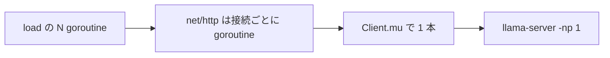

# 002 Decision Load

先行仕様: `prompts/phases/000-foundation/branches/main/ideas/000-DecisionTest.md`

実施順: `prompts/phases/000-foundation/branches/main/ideas/001-ScoreNoul.md` の実装が終わったあと。この仕様は score / noul の正しさを完了条件にしない。負荷の入力は既存の choice である `features/decision-test/testdata/account.json` を使う。

## 背景 (Background)

1 件ずつの `decide` では、サーバが「負荷を見て拒否する」のか「受けてから中で並べる」のかが分からない。計測したいのは、CPU や GPU の使用率に関係なく受理し、並列に走らせようとするか、である。

調査した実装（llama.cpp `b11056` の `llama-server.exe`、`features/decision-test` の Huma サーバ）は次のとおり。この結論を、あとから並列度を上げる変更で消してはならない。この仕様は計測であって、並列度の引き上げではない。

### llama-server

起動は `scripts/setup/run_llama_server.sh` の固定引数である。

`-m <model> -c 2048 -b 512 -ngl 99 -np 1 --jinja --host <llama_host> --port <llama_port>`

- `-np 1` はスロット数 1 の明示指定である。バイナリの既定は `-np -1`（auto）だが、スクリプトは auto を使っていない。推論の同時実行数は 1。
- `-cb`（continuous batching）の既定は有効。スロットが 1 なので、他のリクエストと同一バッチには入らない。
- CPU 使用率も GPU 使用率も、受理の条件にしていない。
- スロットが埋まっているタスクは、`"slot unavailable"` で拒否せず、`server_queue` の `queue_tasks_deferred` に積む。この deque に件数の上限は無い（[PR 5018](https://github.com/ggml-org/llama.cpp/pull/5018) 以降。`b11056` の `tools/server/server-queue.h` に `defer` がある）。
- HTTP ワーカーは無限ではない。`--threads-http` の既定 `-1` のとき、本数は `max(n_parallel + 4, hardware_concurrency - 1)`。そのプールは、固定スレッドに加えて動的スレッドを最大 1024 本まで足す（`b11056` の `tools/server/server-http.cpp`）。`-np 1` なら下限は 5 本で、実数は CPU の論理コア数側になることが多い。100 接続はこの上限の内側である。
- 読み書きタイムアウトの既定は 3600 秒。GPU が忙しいこと自体では切らない。

したがって llama 側は、論理上は「推論を無限に並列実行」しない。受理は使用率を見ず、待ち行列はコード上は無制限、HTTP 処理スレッドには `基本本数 + 1024` の上限がある。

### Huma（Go の net/http）

`features/decision-test/cmd/decision-test/main.go` の `http.Server` は `Addr` と `Handler` だけを置く。`ReadTimeout`、`WriteTimeout`、同時接続の上限はゼロ値のままである。`net/http` は接続ごとに goroutine を起動し、CPU や GPU の使用率では拒否しない。Huma の `DefaultConfig` も同時実行数を制限しない。

ただし `features/decision-test/internal/engine/llamacpp.go` の `Client.mu` が `ReadLabelLogprobs`、`Generate`、`Warmup` を直列化する。`Health` はロックしない。`POST /v1/systemone` を何件同時に受けても、llama-server へ出る推論は 1 件ずつである。llama の待ち行列は、このミューテックスが残る限り、API 経由の負荷では埋まらない。

まとめると、API は 100 件を拒否せずに受ける。実行は Go のミューテックスで 1 本に並ぶ。llama のスロットも 1 である。どちらも「使用率を見て絞る」実装ではない。

## 要件 (Requirements)

### 必須要件

1. **対象と非対象**
   - 変更してよいのは `features/decision-test` の CLI と、その単体テスト、`tests/decision_systemone_test.go` だけ。
   - `-np`、`run_llama_server.sh`、`Client.mu`、`POST /v1/systemone` の入出力、`decide` のフラグは変えない。
   - サーバ側に同時実行数の上限や、負荷に応じた 429 は足さない。
   - llama-server へ直接負荷をかけるモードは作らない。経路は既存の `POST /v1/systemone` だけ。

2. **サブコマンド**
   - 名前は `load`。`decide` とは別コマンドにする。
   - フラグは `--input`（必須）、`--server`（省略時は `decide` と同じく設定の API）、`--method`（省略時は入力 JSON の method。空ならサーバ既定の `direct`）、`--concurrency`（必須、1 以上の整数）、`--json`。
   - 1 回の起動で投げるリクエスト数は `--concurrency` と同じ。ワーカープールでそれより少なく絞らない。
   - 全リクエストの本文は、`--method` を `decide` と同じ規則で反映した同じバイト列。質問の中身は変えない。

3. **並列の出し方**
   - goroutine を `--concurrency` 本起動する。開始前に全 goroutine を待ち、一斉に放す。計測の起点はその解放時刻。
   - 各 goroutine は 1 回だけ POST する。失敗しても他の goroutine は止めない。
   - `http.Transport` の `MaxConnsPerHost` は 0（無制限）。`MaxIdleConnsPerHost` は `--concurrency` 以上。既定クライアントのアイドル数 2 に依存しない。リクエストのタイムアウトは `decide` と同じ 10 分。
   - レイテンシは、その goroutine の POST 開始からレスポンス本文を読み終わるまで。`wall_ms` は解放時刻から、最後の goroutine が終わるまで。

4. **集計**
   - HTTP 状態が 200 以上 300 未満を成功とする。それ以外と、接続エラーは失敗。失敗理由は件数に含め、他の成功を無効にしない。
   - 終了コードは、失敗が 0 のときだけ 0。集計は失敗があっても stdout に書く。
   - `--json` のときは次の 1 オブジェクトだけを stdout に書く。キーの不足は許さない。パーセンタイルは、レイテンシを昇順に並べ、0 始まりの index `ceil(p/100*n) - 1`。n が 1 のときは index 0。補間はしない。

   ```json
   {
     "concurrency": 10,
     "requests": 10,
     "success": 10,
     "errors": 0,
     "statuses": {"200": 10},
     "wall_ms": 1200.5,
     "latency_ms": {"min": 80.0, "p50": 600.0, "p95": 1100.0, "max": 1200.0},
     "throughput_rps": 8.33
   }
   ```

   - `throughput_rps` は `success / (wall_ms / 1000)`。`wall_ms` が 0 のときは 0。
   - `statuses` のキーは HTTP 状態の十進文字列。接続エラーはキー `"0"`。
   - `--json` が無いときは、同じ値を 1 行ずつ `key: value` で書く。`latency_ms` は `latency_min_ms`、`latency_p50_ms`、`latency_p95_ms`、`latency_max_ms` に分ける。`statuses` は `status_<code>: <count>`。
   - 成功した本文の `answers.*.timings.direct_ms` は、サーバが付けていれば合計して `direct_ms_sum` を JSON と人間可読の両方に出す。1 件も取れなければキーを出さない。この値は合否に使わない。ミューテックス待ちと推論時間の切り分け用である。

5. **計測点**
   - 同じサーバに対し、concurrency 1、10、50、100 をこの順で、前の実行が終わってから次を始める。同時に 4 段階を重ねない。
   - 入力は `features/decision-test/testdata/account.json`。method は `direct`。生成は測らない。
   - 100 件が全部成功することをもって、「この範囲では拒否しない」の確認とする。件数をさらに増やして無限を実証することは、この仕様の完了条件にしない。
   - スループットが concurrency に比例することは要求しない。比例しないことは、現状の直列化と矛盾しない。特定のミリ秒や tokens/s を合格線にしない。

6. **health**
   - concurrency 50 の実行中に `GET /health` する。3 秒以内に HTTP 200、`ready` が true。推論用ミューテックスが health を止めていないことの確認である。

### 任意要件（本仕様では実装しない）

- `-np` を 1 より大きくする。llama の待ち行列を API 経由で満たす。
- `Client.mu` を外す、または推論だけロックしない経路を足す。
- サーバ側のキュー長メトリクス、Prometheus、GPU 使用率の採取。
- `generation` と `both` の負荷。
- 100 を超える concurrency の合格条件。

## 実現方針 (Implementation Approach)



- 新しい HTTP エンドポイントは作らない。`internal/cli` に `Load` を置き、`cmd/decision-test` から `load` サブコマンドで呼ぶ。
- 単体テストは `httptest` だけを使う。ハンドラが処理中の件数を数え、concurrency 10 で最大同時数が 10 になることを見る。これでクライアントが直列化していないことを、llama なしで固定する。
- 統合テストだけが実サーバと実 GGUF を使う。サーバの起動方法は `000-DecisionTest` の統合テストと同じ。ポートは 18199。既存の 18191 から 18198 と重ならないようにする。

## 検証シナリオ (Verification Scenarios)

共通の起動は `000-DecisionTest` と同じ。リポジトリルートで llama-server が `/health` に成功し、`bin/decision-test`（Windows では `bin/decision-test.exe`）が `ready: true` を返すこと。`-np` は 1 のまま。

1. 単体テストで、遅延する `httptest` に concurrency 10 を投げる。最大同時処理数が 10。成功 10。失敗 0。
2. 統合テストが API をポート 18199 で起動する。
3. `load --input features/decision-test/testdata/account.json --concurrency 1 --method direct --json` を、その API に対して実行する。成功 1、失敗 0、`statuses` は `"200": 1`。`wall_ms` は 0 より大きい。
4. 同じサーバで concurrency 10、続けて 50、続けて 100 を実行する。各段階で成功数は concurrency と一致し、失敗は 0、状態は 200 だけ。
5. concurrency 50 の実行中に `GET /health` する。3 秒以内に HTTP 200、`ready` は true。
6. 4 段階の `wall_ms`、`latency_ms`、`throughput_rps`、取れていれば `direct_ms_sum` をテストログに残す。concurrency に比例したスループットは断言しない。100 件の途中で 429 や 503 が出たら失敗。
7. 既存の `TestDecisionSystemOne_DirectAccount` を、この変更のあとに再実行し、choice の direct が壊れていないことを見る。

## テスト項目 (Testing for the Requirements)

単体テストは外部通信をしない。統合テストだけが実 llama-server と実 GGUF を使う。`t.Skip` は禁止。llama-server が無い統合テストは `t.Fatal`。

このリポジトリの `scripts/process/integration_test.sh` に `--categories` は無い。絞り込みは `--specify` のみ。

| 要件 | テスト |
| --- | --- |
| 3 クライアントが本当に並列 | `internal/cli`。concurrency 10 で httptest の最大同時数が 10 |
| 4 集計と終了コード | 同じパッケージ。2xx 以外を 1 件混ぜ、`errors` が 1、終了コードが非 0、他の成功は集計に残る |
| 5 の 1 / 10 / 50 / 100 | `tests/decision_systemone_test.go` の `TestDecisionSystemOne_Load` |
| 6 health が推論ロックの外 | 同じテストの 50 件の最中 |
| 1 choice 非退行 | 既存の `TestDecisionSystemOne_DirectAccount` |

### ビルド・全体検証

1. ビルドと単体テスト:

```bash
./scripts/process/build.sh
```

2. 負荷と choice の退行:

```bash
./scripts/process/integration_test.sh --specify "TestDecisionSystemOne_Load|TestDecisionSystemOne_DirectAccount"
```

全カテゴリ一括は、このスクリプトにカテゴリが無く、本仕様の完了条件に含めない。

完了と言ってよいのは、1 / 10 / 50 / 100 がすべて HTTP 200 で返り、クライアントが 10 同時を実際に張れ、health が 50 件の最中に 200 であることまでである。GPU 使用率の上限や、llama スロットを 1 より増やすことは要求しない。
