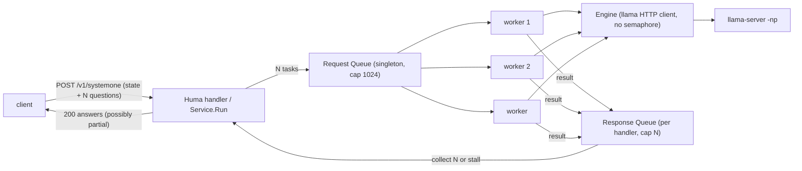

# 003 Decision Worker Pool

先行仕様: `prompts/phases/000-foundation/branches/main/ideas/000-DecisionTest.md`、`prompts/phases/000-foundation/branches/main/ideas/001-ScoreNoul.md`、`prompts/phases/000-foundation/branches/main/ideas/002-DecisionLoad.md`

調査根拠: `tmp/investigate/decision-test-jev-batch-gap.md`（調査ワークフローの成果。リポジトリにはコミットしない）。

## 背景 (Background)

[Jev](https://www.jevai.org/docs) の 1 リクエストは、共有の `state` と、それぞれ独立に答える複数の `questions`（質問 ID → 質問）を一度に送る構造である。Playground は「All questions share this context and are answered independently.」と説明し、1 run に最大 8 質問を載せる。性能の単位は「1 リクエストに含まれる N 質問をサーバがどれだけ速くまとめて返すか」であり、クライアントが HTTP 接続を何本張れるかではない。

`features/decision-test` の Request JSON の形はこの仕様と一致している。`internal/domain/validate.go` は `questions` を質問 ID のキーで出現順に読み、`answers` を同じ ID で返す。Playground が生成する次の JSON は、そのまま `POST /v1/systemone` に受理される。

```json
{
  "state": "I was charged twice for my subscription. Please refund the duplicate payment today; I need the money for an upcoming bill.",
  "questions": {
    "department": {
      "type": "choice",
      "instructions": "Which team should handle this support ticket?",
      "criteria": {
        "billing": "Payments, invoices and refunds",
        "technical": "Bugs and integration failures",
        "other": "None of the other teams fit"
      }
    },
    "urgency": {
      "type": "score",
      "instructions": "How urgently does the customer need a response?",
      "criteria": [
        "No deadline or immediate impact",
        "Needs a timely response but can wait",
        "Explicit same-day deadline or immediate impact"
      ]
    },
    "wants_refund": {
      "type": "noul",
      "instructions": "Is the customer explicitly asking for a refund?"
    }
  }
}
```

乖離は処理モデルと計測の単位にある。

- `internal/decision/service.go` の `Service.Run` は質問を for ループで直列に処理し、質問 1 件につき llama-server を 1 回（`both` は 2 回）呼ぶ。N 質問の所要時間は N × 単発になり、まとめて送る利得が無い。
- `internal/engine/llamacpp.go` はセマフォ（容量 `llama_parallel`、既定 1）で llama 呼び出しを絞る。
- `load` は同じ 1 質問の本文を `--concurrency` 本の HTTP で投げ、リクエスト単位でしか集計しない。
- この逐次処理は 000 要件 7「質問ごとに順に実行する。質問間で GPU を奪い合わない」、000 要件 8「ミューテックスで直列化する」、001「質問 ID の出現順に 1 問ずつ実行する」が明示し、`TestServiceBothOrder` と `TestDecisionSystemOne_Mixed` が assert している。

本仕様は、サーバ内にワーカープールを置いて 1 リクエストの質問を並列に処理し、質問数とスロット数を軸に計測する。000 要件 7・8、001 の「1 問ずつ」、002 の `llama_parallel` セマフォは本仕様が置き換える。002 と同じ慣例で、旧仕様の本文は書き換えない。

## 要件 (Requirements)

### 必須要件

1. **対象と非対象**
   - 変更してよいのは `features/decision-test`、`settings/decision-test.yaml`、`README.md`（設定表、`load` の説明、フィクスチャ一覧）、`tests/decision_systemone_test.go`。`scripts/setup/run_llama_server.sh` は変えない（`--parallel` は既にある）。
   - `POST /v1/systemone` の入力形は、要件 6 の `instructions` の型拡張を除いて変えない。出力形は、要件 4 の「`answers` に欠けた質問 ID があり得る」点だけ変わる。
   - `-c 2048` は固定。`--kv-unified` は付けない。リクエストの `cache_prompt` は `false` のまま。002 と計測条件を揃えるためで、プロンプトキャッシュの効果は別仕様で測る。
   - 非同期応答（202 とポーリング）は作らない。Jev 互換 API はレスポンスまで同期である。

2. **ワーカープール（シングルトンの Request Queue）**
   - プロセスに 1 つ。`internal/decision` に置き、`cmd/decision-test` の `buildServer` がウォームアップ成功後に 1 つ生成して起動する。
   - Request Queue は容量 1024 の buffered channel。容量は定数。満杯のときの投入はブロックし、その待ちは要件 4 の停滞判定に含まれる。
   - ワーカー数は設定 `workers`。省略または 0 は 16。負は設定エラー `workers must be >= 1`。起動時に `workers` 本の goroutine を起動し、サーバ停止時に止める。
   - タスクは質問 1 件。内容は `state` の本文、`Question`、`method`、ハンドラの `context.Context`、ハンドラ専用の Response Queue。`method: both` は同じワーカー内で direct → generation の順に実行し、`timings.ratio` の意味を保つ。
   - ワーカーは取り出したタスクの ctx が既に終了していれば実行せず捨てる（DEBUG ログ、結果は送らない）。
   - 実行したタスクの結果（回答またはエラー）は必ずそのタスクの Response Queue に 1 件送る。Response Queue の容量はそのリクエストの質問数とし、送信は決してブロックしない。ハンドラが先に戻っていても送信は成功し、結果は捨てられる。
   - llama への同時呼び出し数はワーカー数で決まる。エンジンのセマフォと設定 `llama_parallel` は撤去する。`NewClient` の第 3 引数は `http.Transport.MaxIdleConnsPerHost` の値（ワーカー数）にし、接続の作り直しを避ける。`Health` は従来どおりプールを通らない。
   - スロット数を超える呼び出しは llama-server 側の deferred queue に積まれる（002 の調査どおり拒否されない）。このため `timings.direct_ms` は llama 側の待ちを含む「エンジン呼び出しの所要時間」になる。README にその旨を書く。

3. **ハンドラ（同期応答）**
   - HTTP 422 の検証はキュー投入前に行う（現状どおり）。検証で落ちたリクエストはタスクを 1 件も投入しない。
   - `Service.Run` は質問を出現順にタスク化して Request Queue に投入し、Response Queue から質問数分を回収し、`answers` を質問 ID で組み立てる。回収順は問わない。
   - `usage` は回収した回答の `input_tokens` / `output_tokens` の合計。`elapsedMs` はハンドラ入口から応答組み立てまで（現状どおり）。
   - エンジンエラー（`ErrEngine`）の結果が 1 件でも回収されたら、残りを取り消して HTTP 502 を返す（000 要件 2 の意味を維持）。
   - ハンドラが戻るとき（正常・停滞・エラー・クライアント切断のいずれも）はそのリクエストの ctx を cancel する。未着手タスクは要件 2 のとおり捨てられ、実行中の llama HTTP 呼び出しは `http.NewRequestWithContext` 経由で中断される。
   - クライアント切断（リクエスト ctx の終了）を検知したら回収を打ち切って戻る。

4. **停滞の検出と切り上げ**
   - ハンドラは `submitted`（自分が Request Queue に投入したタスク数）と `received`（自分の Response Queue から回収した結果数）を監視する。どちらかが増えるたびにタイマーを `stall_timeout_ms` に戻す。
   - `stall_timeout_ms` の間どちらも増えなければ停滞と判定し、投入を止め、以後の回収も待たず、回収済みの回答だけで HTTP 200 を返す。欠けた質問 ID は `answers` に含めない。エラー形式にはしない。
   - 設定 `stall_timeout_ms`。省略または 0 は 15000。負は設定エラー `stall_timeout_ms must be >= 1`。
   - 停滞時は WARN ログ 1 行: `systemone stalled` に `questions`、`submitted`、`received`、`missing_ids`、`stall_timeout_ms`。
   - この判定はハンドラ単位である。HTTP 同時数が大きく、FIFO の待ちが `stall_timeout_ms` を超えた 1 質問リクエストも「欠けた 200」になる。既知の性質として README に書き、運用側は `stall_timeout_ms` で調整する。002 の計測範囲（スロット 1 で concurrency 100、約 4 秒）は 15 秒の内側である。

5. **`/health`**
   - `workers`（設定値）と `queue_depth`（Request Queue の現在長）を追加する。OpenAPI の説明を付ける。

6. **`instructions` の型**
   - Jev と同じく string / object / array を受理する。object / array は `state` と同じ規則で JSON 文字列化してプロンプトの `Question:` 直下に埋める。
   - 空文字、空白のみ、null、欠落は 422 `instructions must not be empty`。数値・真偽値は 422 `instructions must be a string, object, or array`。
   - `decide` / `load` が `--method` を反映する経路（`marshalRequest`）は、`instructions` の元 JSON をそのまま書き戻す。

7. **ログ**
   - `server starting` INFO に `workers` と `stall_timeout_ms` を足す。
   - `systemone accepted` DEBUG は現状どおり（`questions`、`method`）。完了時に DEBUG `systemone completed`: `answered`、`missing`、`duration_ms`。
   - 質問単位の `direct completed` / `generation started` DEBUG は残す（`question_id`、`question_type`）。
   - 取り消し済みタスクの skip は DEBUG。ctx cancel による llama 呼び出しの失敗は ERROR にしない。llama が非 2xx を返した場合の ERROR は現状どおり。

8. **`load` の拡張（質問数を軸にする）**
   - `--questions n`（任意）。省略または 0 は入力のまま送る。1 以上のとき、入力の `questions` を出現順に先頭 n 件へ切り詰める。ID と内容は変えない。n が入力の件数を超えたらエラー（`input has 30 questions; --questions 31 exceeds it` の形）。負はエラー。
   - `--workers m`（任意、既定 0）。集計に書くだけで、サーバのワーカー数は変えない（`--slots` と同じ扱い）。
   - `--input`、`--concurrency`、`--slots` の必須と、`--server`、`--method`、`--json` の意味は 002 のまま。
   - 集計に次を追加する。`--json` は 002 のキーにこれらを足した 1 オブジェクト。人間可読は同名の行。
     - `workers`: `--workers` の値。
     - `questions`: 1 リクエストの質問数（`--questions` 反映後の本文の件数）。
     - `answers`: 成功した応答の `answers` に含まれる回答数の合計。
     - `answers_missing`: `success × questions − answers`。
     - `questions_per_sec`: `answers / (wall_ms / 1000)`。`wall_ms` が 0 のときは 0。
   - 終了コードは、`errors` が 0 かつ `answers_missing` が 0 のときだけ 0。`answers_missing` が正なら stderr に `answers_missing N` を書く。集計はどちらの場合も stdout に書く。

9. **フィクスチャ**
   - `features/decision-test/testdata/playground.json`: 背景に載せた Playground 生成 JSON をそのまま置く。
   - `features/decision-test/testdata/bank.json`: `state` は `account.json` と同じ文。`questions` は 30 件で、choice / score / noul をこの順に繰り返す（各 10 件）。`--questions n` で先頭 n 件を切り出すため、n = 1, 5, 10, 15, 20, 30 のいずれでも 3 型が混ざる（n = 1 は choice のみ）。各質問の direct プロンプトは 256 トークン以内に収める（スロット 6 で `2048 / 6` に収めるため）。

     | # | ID | type | instructions | criteria |
     | --- | --- | --- | --- | --- |
     | 1 | `queue` | choice | Which queue should handle this request? | `account_access`: Account access support / `billing`: Billing support / `close`: Close as resolved |
     | 2 | `frustration` | score | How frustrated is the customer? | Calm / Frustrated / Very angry |
     | 3 | `is_urgent` | noul | Does this convey urgency? | 省略 |
     | 4 | `channel` | choice | Which channel should the reply use? | `email`: Reply by email / `phone`: Call the customer / `chat`: Continue in live chat / `none`: No reply needed |
     | 5 | `severity` | score | How severe is the impact on the customer? | No impact / Minor inconvenience / Blocked from a key task / Complete loss of access |
     | 6 | `mentions_email_delivery` | noul | Does the customer report that expected emails did not arrive? | `true`: Emails were expected and did not arrive / `false`: No email delivery problem is mentioned |
     | 7 | `root_cause` | choice | What is the most likely root cause? | `lockout_policy`: Account lockout still active / `reset_not_applied`: Password reset did not apply / `email_delivery`: Unlock emails blocked or delayed / `user_error`: Wrong credentials |
     | 8 | `clarity` | score | How clearly does the customer describe the problem? | Unclear / Partially clear / Clear |
     | 9 | `needs_escalation` | noul | Should this be escalated to a specialist? | 省略 |
     | 10 | `next_action` | choice | What should the agent do first? | `unlock_account`: Manually unlock the account / `resend_email`: Resend the unlock email / `verify_identity`: Verify the customer identity / `ask_details`: Ask for more details |
     | 11 | `sentiment` | score | What is the overall sentiment? | Negative / Neutral / Positive |
     | 12 | `is_repeat_contact` | noul | Does the message indicate more than one attempt to get help? | `true`: The customer already tried more than once / `false`: This is the first attempt |
     | 13 | `priority` | choice | Which priority applies? | `p1`: Critical / `p2`: High / `p3`: Medium / `p4`: Low |
     | 14 | `urgency` | score | How urgently does the customer need a response? | No deadline / Soon / Immediately |
     | 15 | `security_risk` | noul | Is there a sign of a security concern such as account takeover? | 省略 |
     | 16 | `category` | choice | Which category fits best? | `authentication`: Login and passwords / `notifications`: Email and alerts / `billing`: Payments / `other`: Something else |
     | 17 | `completeness` | score | How complete is the information for troubleshooting? | Missing key facts / Some facts missing / Complete |
     | 18 | `wants_refund` | noul | Is the customer asking for a refund? | `true`: A refund is requested / `false`: No refund is requested |
     | 19 | `sla_tier` | choice | Which SLA tier does this fall under? | `standard`: Standard / `expedited`: Expedited / `immediate`: Immediate |
     | 20 | `churn_risk` | score | How likely is the customer to leave? | Unlikely / Possible / Likely / Very likely |
     | 21 | `has_workaround` | noul | Does the customer mention a workaround that works? | 省略 |
     | 22 | `product_area` | choice | Which product area is affected? | `login`: Login / `password_reset`: Password reset / `email`: Email delivery / `account_settings`: Account settings |
     | 23 | `politeness` | score | How polite is the customer? | Rude / Neutral / Polite |
     | 24 | `self_service_possible` | noul | Could the customer resolve this without an agent? | `true`: A self-service path exists / `false`: Agent action is required |
     | 25 | `reply_tone` | choice | Which tone should the reply use? | `apologetic`: Apologetic / `neutral`: Neutral / `reassuring`: Reassuring |
     | 26 | `technical_depth` | score | How technical is the customer's description? | Non-technical / Somewhat technical / Highly technical |
     | 27 | `blocked_completely` | noul | Is the customer completely unable to use the account? | 省略 |
     | 28 | `followup_window` | choice | When should the agent follow up? | `within_hour`: Within one hour / `same_day`: Same day / `next_day`: Next business day / `no_followup`: No follow-up |
     | 29 | `resolution_confidence` | score | How confident can the agent be that a manual unlock resolves this? | Low / Medium / High |
     | 30 | `mentions_password_reset` | noul | Does the customer say the password reset succeeded? | `true`: The reset is described as successful / `false`: The reset is not described as successful |

10. **設定と README**
    - `settings/decision-test.yaml`: `llama_parallel` を削除し、`workers: 16` と `stall_timeout_ms: 15000` を追加する。`llama_parallel` が利用者のローカルファイルに残っていても読まない（yaml.v3 は未知キーを無視する）。
    - `README.md`: 設定表を `workers` / `stall_timeout_ms` に差し替え、`load` の節に `--questions` と `--workers` を足し、フィクスチャ一覧に `bank.json` と `playground.json` を足す。要件 2 の `direct_ms` の意味と要件 4 の「欠けた 200」を書く。

11. **既存テストの改訂**
    - `internal/decision` の `TestServiceBothOrder`: 質問ごとに read → generate の順であること、全質問 ID が `answers` に存在することを assert する。質問をまたいだ呼び出し順は assert しない。
    - `tests/decision_systemone_test.go` の `TestDecisionSystemOne_Mixed`: 質問 ID ごとに `direct completed` が `generation started` より前にあることを assert する。ID 間の順序は assert しない。
    - `internal/engine` の `TestSerializeRequests` と `TestTwoSlotOverlap` は撤去する。同時数の固定は `internal/decision` のプールの単体テストに移す。
    - `TestDecisionSystemOne_Load` の設定書き出しは `llama_parallel: N` を `workers: N` に変える。スロット 1、2、4 と concurrency 1、10、50、100 の合否は 002 のまま。`stall_timeout_ms` は既定の 15000 を使う。002 の計測ではスロット 1 の concurrency 100 が約 4 秒で終わっており、FIFO の最後尾の待ちは 15 秒の内側である。`answers_missing` が正になれば要件 4 の切り上げが起きたことを意味し、失敗として扱う。

12. **計測点**
    - スロット 1、2、3、4、5、6 の順に、llama-server を `-np <slots>` で `127.0.0.1:18280` に起動し直す。API は `workers: 30`、`stall_timeout_ms: 15000`、`llama_url: http://127.0.0.1:18280`、`api_port: 18199` で起動する。
    - 各スロット数で質問数 n = 1、5、10、15、20、30 をこの順に行う。`load --input features/decision-test/testdata/bank.json --questions <n> --method direct --concurrency 1 --slots <slots> --workers 30 --json`。前の実行が終わってから次を始める。全 36 回。
    - 36 回とも `requests` 1、`success` 1、`errors` 0、`statuses` は `{"200": 1}`、`questions` = n、`answers` = n、`answers_missing` 0、`wall_ms` > 0。
    - 各スロット数の n = 30 の実行中に `GET /health` する。3 秒以内に HTTP 200、`ready` true、`workers` 30。
    - 各スロット数の終了後、API ログに `level=ERROR` と `systemone stalled` が無い。
    - 36 回の `wall_ms`、`latency_ms.p50`、`questions_per_sec`、取れていれば `direct_ms_sum` をテストログに残す。所要時間がスロット数や質問数に比例することは要求しない。特定のミリ秒を合格線にしない。
    - スロット 3、5、6 は 2048 を割り切らないため、llama.cpp がスロットあたり文脈を 256 の倍数へ丸めて総文脈が増える場合がある。VRAM に収まらず起動または推論に失敗した組はスキップせず失敗とする。

### 任意要件（本仕様では実装しない）

- リクエストの `cache_prompt: true`、llama-server の `--cache-ram`、`--kv-unified`。共有 `state` の接頭辞再利用は効果が見込めるが、本仕様の計測（ワーカープールの効果）と混ざるため別仕様にする。
- llama-server `/completion` の複数 `prompt` 配列による 1 HTTP バッチ。
- 非同期応答、Request Queue 満杯時の 429、サーバ全体の停滞検出、欠けた質問 ID を示すレスポンスフィールド。
- `generation` / `both` の質問数ベンチマーク。

## 実現方針 (Implementation Approach)



### データ構造

`internal/decision/pool.go`（新規）:

```go
const requestQueueCapacity = 1024

type task struct {
	ctx      context.Context
	state    string
	question domain.Question
	method   domain.Method
	results  chan<- result
}

type result struct {
	id     string
	answer domain.Answer
	used   usage
	err    error
}

// executor runs one question; Service.one satisfies it.
type executor func(ctx context.Context, state string, question domain.Question, method domain.Method) (domain.Answer, usage, error)

type Pool struct {
	queue   chan task
	exec    executor
	log     *logger.Logger
	workers int
}

func NewPool(workers int, exec executor, log *logger.Logger) *Pool
func (p *Pool) Start(ctx context.Context) // launches p.workers goroutines; they exit when ctx is done
func (p *Pool) Depth() int                // len(p.queue)
func (p *Pool) Workers() int
```

`internal/decision/service.go`:

```go
type Service struct {
	Engine       engine.Engine
	Labels       []engine.Label
	Log          *logger.Logger
	ModelID      string
	Pool         *Pool
	StallTimeout time.Duration
}
```

`Service.Run` の骨子:

```go
ctx, cancel := context.WithCancel(ctx)
defer cancel()
results := make(chan result, len(req.Questions))
timer := time.NewTimer(s.StallTimeout)
submitted, received := 0, 0
for received < len(req.Questions) {
	var submit chan<- task // nil once every question is submitted; a nil channel is never selected
	if submitted < len(req.Questions) {
		submit = s.Pool.queue
	}
	select {
	case submit <- task{ctx, state, req.Questions[submitted], req.Method, results}:
		submitted++
		resetTimer(timer, s.StallTimeout)
	case r := <-results:
		received++
		if r.err != nil {
			return domain.Response{}, r.err // 502 path; deferred cancel drops the rest
		}
		resp.Answers[r.id] = r.answer
		resp.Usage.InputTokens += r.used.in
		resp.Usage.OutputTokens += r.used.out
		resetTimer(timer, s.StallTimeout)
	case <-timer.C:
		s.Log.Warn("systemone stalled", ...)
		return resp, nil // partial answers, HTTP 200
	case <-ctx.Done():
		return domain.Response{}, ctx.Err()
	}
}
```

ワーカーの骨子:

```go
for {
	select {
	case <-ctx.Done():
		return
	case t := <-p.queue:
		if t.ctx.Err() != nil {
			p.log.Debug("task skipped", "question_id", t.question.ID)
			continue
		}
		answer, used, err := p.exec(t.ctx, t.state, t.question, t.method)
		t.results <- result{id: t.question.ID, answer: answer, used: used, err: err}
	}
}
```

`internal/config/config.go`:

```go
type File struct {
	// ... existing fields; LlamaParallel is removed
	Workers        int `yaml:"workers"`
	StallTimeoutMs int `yaml:"stall_timeout_ms"`
}
```

`internal/domain/types.go`:

```go
// Text holds a JSON string, object, or array and renders it for the prompt.
type Text struct{ raw json.RawMessage }

func (t Text) PromptText() (string, error)

type State = Text

type Question struct {
	ID           string
	Type         string
	Instructions Text
	Criteria     []Criterion
	// ...
}

type Health struct {
	// ... existing fields
	Workers    int `json:"workers" doc:"Configured worker count of the decision pool."`
	QueueDepth int `json:"queue_depth" doc:"Tasks currently waiting in the request queue."`
}
```

`internal/domain/validate.go` に `TakeQuestions(raw []byte, n int) ([]byte, error)` を足す。`parse` → 先頭 n 件 → `marshalRequest` の順で、`ApplyMethod` と同じ部品を使う。

`internal/cli/load.go`:

```go
type LoadOptions struct {
	// ... existing fields
	Questions int
	Workers   int
}

type LoadReport struct {
	// ... existing fields
	Workers         int     `json:"workers"`
	Questions       int     `json:"questions"`
	Answers         int     `json:"answers"`
	AnswersMissing  int     `json:"answers_missing"`
	QuestionsPerSec float64 `json:"questions_per_sec"`
}
```

### 変更するファイル

| パス | 変更 |
| --- | --- |
| `features/decision-test/internal/decision/pool.go` | 新規。`Pool`、`task`、`result`、ワーカーループ |
| `features/decision-test/internal/decision/service.go` | `Run` を投入・回収・停滞判定に置き換える。`one` は executor として残す |
| `features/decision-test/internal/engine/llamacpp.go` | セマフォ撤去。`NewClient(baseURL, log, maxIdleConns)`。`Warmup` の acquire 撤去 |
| `features/decision-test/internal/config/config.go` | `Workers`、`StallTimeoutMs`。`LlamaParallel` 削除 |
| `features/decision-test/internal/domain/types.go`、`validate.go` | `Text`、`Instructions` の型、`TakeQuestions`、`Health` の追加フィールド |
| `features/decision-test/internal/prompt/prompt.go` | `instructions` を `Text` から受ける |
| `features/decision-test/internal/api/api.go` | 変更なしが原則。`Run` の戻りが部分回答でも 200 を返すことを確認 |
| `features/decision-test/internal/cli/load.go` | `--questions`、`--workers`、集計と終了コード |
| `features/decision-test/cmd/decision-test/main.go` | プール生成と起動、停止時の cancel、`/health` へ `workers` と `queue_depth`、`load` のフラグ |
| `features/decision-test/testdata/bank.json`、`playground.json` | 新規フィクスチャ |
| `settings/decision-test.yaml`、`README.md` | 設定キーと説明 |
| `tests/decision_systemone_test.go` | `TestDecisionSystemOne_Batch` 新規、`Mixed` と `Load` の改訂 |

### 設計上の決定

- プールは `internal/decision` に置く。ワーカーが `Service.one` を呼ぶため、別パッケージにすると import が循環する。
- Response Queue の容量を質問数にすることで、ワーカーはハンドラの生死に関係なく結果を送れる。ハンドラが戻った後の結果はチャネルとともに回収される。
- 停滞判定を「自分のカウンタが動いたか」にするのは依頼者の設計に従う。サーバ全体の進捗は見ない。
- エンジンのセマフォを外す代わりに、ワーカー数を llama への同時呼び出しの上限にする。2 つの絞りを持たない。
- 既存 far-knowledge「Engine semaphore capacity must equal llama_parallel」は本仕様で無効になる。実装後に record-far-knowledge で置き換えを記録し、記憶文書を直接編集しない。

## 検証シナリオ (Verification Scenarios)

モデルファイルと `llama-server` バイナリがあること。統合テストは自分で llama-server を `127.0.0.1:18280` に起動する。利用者が別ポートで起動しているプロセスは止めない。

### 1. 環境とヘルス

1. `run_llama_server.sh` で llama-server を起動し、`bin/decision-test.exe` を既定設定（`workers: 16`）で起動する。
2. `GET /health` が 200 を返し、`ready` true、`workers` 16、`queue_depth` 0。
3. サーバログの `server starting` INFO に `workers=16` と `stall_timeout_ms=15000` がある。

### 2. Playground の JSON をそのまま処理する

1. `decide --input features/decision-test/testdata/playground.json --method direct --json` を実行する。
2. HTTP 200。`answers` のキーは `department`、`urgency`、`wants_refund` の 3 つ。
3. `department.type` は `choice` で `choice` は `billing` / `technical` / `other` のいずれか。`urgency.type` は `score` で `score` は 0 以上 2 以下。`wants_refund.type` は `noul` で `noul` は 0 以上 1 以下。
4. サーバログに `systemone completed` があり `answered=3 missing=0`。

### 3. 30 質問を 1 リクエストで処理する

1. `decide --input features/decision-test/testdata/bank.json --method direct --json` を実行する。
2. HTTP 200。`answers` のキーは bank.json の 30 ID と一致する。
3. `usage.output_tokens` は 30（direct は質問ごとに 1 トークン）。
4. `GET /health` の `queue_depth` は処理後に 0 に戻る。

### 4. 停滞の切り上げ（単体テスト、フェイクエンジン）

1. 質問 `a`、`b`、`c` のうち `b` だけ結果を返さない（ctx が終わるまでブロックする）フェイクエンジンを用意する。`StallTimeout` は 200 ms。
2. `Run` は 200 ms 以上経ってから戻り、エラーではない。`answers` は `a` と `c` の 2 件で `b` が無い。
3. WARN ログに `systemone stalled` があり、`questions=3 submitted=3 received=2 missing_ids=b`。
4. `Run` が戻った後、`b` のタスクに渡された ctx は終了している（フェイクエンジンが `ctx.Done()` で解放される）。

### 5. 進捗があればタイマーが戻る（単体テスト）

1. 各質問に 150 ms かけて答えるフェイクエンジンと、ワーカー 1、`StallTimeout` 200 ms、質問 5 件で `Run` する。
2. 全体は 750 ms 以上かかるが、5 件すべての回答が返り、`systemone stalled` は出ない。

### 6. エンジンエラーは 502

1. 質問 2 件のうち 1 件でラベル logprob が欠けるフェイクエンジンで `POST /v1/systemone` する。
2. HTTP 502。本文に `missing option logit for A` と `detail`。

### 7. `instructions` の型

1. `instructions` が `{"ask": "Which queue?", "hint": "billing or access"}` の質問を `decide` する。
2. HTTP 200。プロンプトの `Question:` 直下にその JSON テキストが埋まる（単体テストのゴールデン）。
3. `instructions` が `123` の質問を POST すると 422 `instructions must be a string, object, or array`。`""` は 422 `instructions must not be empty`。

### 8. `load --questions`

1. `load --input features/decision-test/testdata/bank.json --questions 5 --method direct --concurrency 1 --slots 1 --workers 16 --json` を実行する。
2. `questions` 5、`answers` 5、`answers_missing` 0、`questions_per_sec` > 0、`workers` 16。終了コード 0。
3. `--questions 31` はサーバに送らずエラーで終了する。

### 9. 欠けた回答の集計（単体テスト、httptest）

1. `answers` を 3 件中 2 件だけ返す httptest サーバに `--questions 3 --concurrency 2` で `load` する。
2. `success` 2、`answers` 4、`answers_missing` 2、終了コードは非 0、stderr に `answers_missing 2`。

### 10. 質問数 × スロット数のベンチマーク

1. スロット 1、2、3、4、5、6 の順に、`-np` をその数にして llama-server を 18280 で起動し、`workers: 30` の API を 18199 で起動する。
2. 各スロット数で `load --input features/decision-test/testdata/bank.json --questions <n> --method direct --concurrency 1 --slots <slots> --workers 30 --json` を n = 1、5、10、15、20、30 の順に行う。
3. 36 回とも `success` 1、`errors` 0、`statuses` は `{"200": 1}`、`questions` = n、`answers` = n、`answers_missing` 0、`wall_ms` > 0。
4. 各スロット数の n = 30 の実行中に `GET /health` が 3 秒以内に 200、`ready` true、`workers` 30。
5. 各スロット数の終了後、API ログに `level=ERROR` と `systemone stalled` が無い。
6. 36 回の `wall_ms`、`latency_ms.p50`、`questions_per_sec`、`direct_ms_sum` をテストログに残す。比例は断言しない。

### 11. 退行

1. `TestDecisionSystemOne_DirectAccount` を既定設定で再実行し、choice の direct が壊れていないこと。
2. `TestDecisionSystemOne_Mixed` を再実行し、3 質問すべてに `generation` と `timings.ratio` があり、質問 ID ごとに `direct completed` が `generation started` より前にあること。
3. `TestDecisionSystemOne_Load` を `workers: N` で再実行し、スロット 1、2、4 × concurrency 1、10、50、100 が全て 200 で `answers_missing` 0 であること。

## テスト項目 (Testing for the Requirements)

単体テストは外部通信をしない。llama-server は `httptest`、エンジンはフェイクで置き換える。統合テストだけが実モデルを使う。`t.Skip` は禁止。llama-server やモデルが無い統合テストは `t.Fatal` で落とす。

| 要件 | テスト |
| --- | --- |
| 2 ワーカー数が同時数の上限 | `internal/decision` `pool_test.go`。解放されるまでブロックする executor に 10 タスク、ワーカー 4 で最大同時数が 4、10 件すべての結果が Response Queue に届く |
| 2 取り消し済みタスクの skip | 同じファイル。投入後に ctx を cancel したタスクは executor が呼ばれず、結果も送られない |
| 2 セマフォ撤去 | `internal/engine` `llamacpp_test.go`。遅い httptest に `NewClient(url, nil, 4)` で 4 本同時に `ReadLabelLogprobs` し、最大同時数が 4（直列化されない）。`TestSerializeRequests` と `TestTwoSlotOverlap` は削除 |
| 3 投入・回収・`usage` | `internal/decision` `service_test.go`。3 質問が全て `answers` に入り、`usage` が合計になる。`both` は質問ごとに read → generate |
| 3 エンジンエラーは 502 | 同じファイルで `ErrEngine` が返ること。`internal/api` `api_test.go` の `TestMissingLogit502` を 2 質問に広げる |
| 4 停滞の切り上げ | `service_test.go`。シナリオ 4 と 5。`StallTimeout` は 200 ms 以下にし、テストは 3 秒以内に終える |
| 4 WARN ログ | 同じテストで `logger` の出力先バッファに `systemone stalled` と各フィールドがあること |
| 5 `/health` | `api_test.go`。`workers` と `queue_depth` がある |
| 6 `instructions` の型 | `internal/domain` `validate_test.go`（string / object / array / 数値 / null / 欠落 / 空白のみ）。`internal/prompt` `prompt_test.go` の object ゴールデン。`marshalRequest` の往復で元 JSON が保たれる |
| 8 `--questions` と集計 | `internal/cli` `load_test.go`。httptest が受けた本文の質問数が n。3 件中 2 件しか返さない httptest で `answers_missing` と終了コード。`--questions` 超過のエラー。`workers` と `questions_per_sec` のキー |
| 8 `TakeQuestions` | `validate_test.go`。n = 0（そのまま）、1、5、件数超過、負 |
| 10 設定 | `internal/config` `config_test.go`。`workers` と `stall_timeout_ms` の省略時既定、負のエラー、`llama_parallel` が残っていてもエラーにならない |
| 9 フィクスチャ | `validate_test.go` で `bank.json` が 30 件、型が c/s/n の繰り返し、ID が一意であることを検証する。`playground.json` が 422 なしに検証を通る |
| 12 ベンチマーク | `tests/decision_systemone_test.go` `TestDecisionSystemOne_Batch`。シナリオ 10 |
| 11 退行 | `TestDecisionSystemOne_DirectAccount`、`TestDecisionSystemOne_Mixed`（ID ごとの順序）、`TestDecisionSystemOne_Load`（`workers: N`） |

### ビルド・全体検証

このリポジトリの `scripts/process/integration_test.sh` は `--categories` を持たない。絞り込みは `--specify` のみ。統合テストは 002 で `-timeout 45m` になっている。

1. ビルドと単体テスト:

```bash
./scripts/process/build.sh
```

2. 質問数 × スロット数のベンチマーク（実 llama-server と MiniCPM5。テストが 18280 / 18199 で自前起動する）:

```bash
./scripts/process/build.sh && ./scripts/process/integration_test.sh --specify "TestDecisionSystemOne_Batch"
```

3. 退行（choice、mixed、HTTP 同時数。`DirectAccount` と `Mixed` は利用者が起動している llama-server を使う）:

```bash
./scripts/process/build.sh && ./scripts/process/integration_test.sh --specify "TestDecisionSystemOne_DirectAccount|TestDecisionSystemOne_Mixed|TestDecisionSystemOne_Load"
```

全カテゴリ一括の統合テストはこのスクリプトにカテゴリが無く、本仕様の完了条件に含めない。

完了と言ってよいのは、スロット 1〜6 のそれぞれで質問数 1、5、10、15、20、30 が 1 リクエストで欠けなく 200 で返り、n = 30 の最中に health が 3 秒以内に 200 で、停滞の切り上げが単体テストで 200 ms のタイマーどおりに動き、002 の HTTP 同時数の合否が `workers: N` で保たれることまでである。所要時間の比例やプロンプトキャッシュの効果は要求しない。
