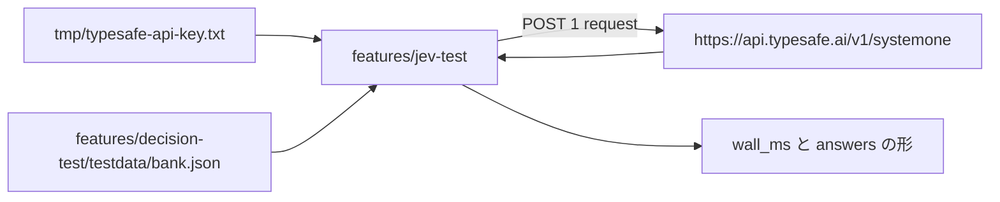

# 004 Jev Official Probe

## 背景 (Background)

`features/decision-test` は、公開されている Jev の Request JSON（共有 `state` と、質問 ID をキーにする `questions`）に合わせたローカルの比較実装である。速度の比較対象が、手元の llama-server だけだと、本家が同じ入力をどれだけで返すかが分からない。

入力は `features/decision-test/testdata/bank.json` とする。このファイルは次のとおりである。

- バイト数は 6818。Playground の 32 KiB 制限より小さい。
- `state` は 1 つの文字列。`model` は無い。
- `questions` は 30 件。出現順に choice 10、score 10、noul 10。質問 ID は重複しない。
- choice の criteria は 2 以上 255 以下、score の criteria は 2 以上 10 以下、noul の criteria は省略か `true` と `false` の両方、という [Playground の規則](https://www.jevai.org/docs) に収まっている。

Playground の画面上の上限は 1 run あたり 8 質問である。本仕様はそれを理由に質問を減らしたり分割したりしない。依頼は、このファイルを 1 回のリクエストとして本家へ送ることである。

API キーは、リポジトリにコミットしない `tmp/typesafe-api-key.txt` に既に置いてある。`tmp/` は `.gitignore` の対象である。キーの値は仕様書、ソース、テスト、ログに書かない。

## 要件 (Requirements)

### 必須要件

1. **配置**
   - 新しい Go モジュールを `features/jev-test` に置く。`go.mod` のモジュールパスは `openjev/features/jev-test`。
   - `main` パッケージは 1 つだけにする。`scripts/process/build.sh` は feature ごとに main が 1 つのときだけ `bin/jev-test`（Windows では `bin/jev-test.exe`）を作る。
   - 依存は Go 標準ライブラリだけにする。`features/decision-test` は import しない。`features/decision-test` のコードと設定は変更しない。
   - 本家への問い合わせを `tests/` の統合テストには入れない。秘密と外部通信と非決定的な所要時間を、通常の `scripts/process/integration_test.sh` に混ぜない。

2. **コマンド**
   - フラグは次のとおり。省略時の値は、リポジトリルートをカレントディレクトリにして実行するときのパスである。
   - `--input`。省略時は `features/decision-test/testdata/bank.json`。
   - `--key-file`。省略時は `tmp/typesafe-api-key.txt`。
   - `--url`。省略時は `https://api.typesafe.ai/v1/systemone`。
   - `--model`。省略時は `typesafe/jev-1.13`。入力 JSON に空でない `model` が既にあるときは、その値を優先し、このフラグでは上書きしない。
   - `--timeout`。省略時は 10 分。`features/decision-test` の `decide` と同じ長さである。
   - `--json`。付けると、stdout には結果オブジェクト 1 つだけを書く。
   - 送る HTTP リクエストは 1 回だけである。質問の分割、並列化、429 や 529 の再試行はしない。再試行は計測する所要時間を歪める。

3. **キー**
   - `--key-file` を UTF-8 で読み、前後の空白と末尾の改行を除いた文字列を Bearer トークンにする。中の空白は削らない。空なら API を呼ばず終了コード 2。
   - ヘッダは `Authorization: Bearer <token>` と `Content-Type: application/json`。
   - トークンを stdout、stderr、エラー文字列、テストの期待値に出さない。401 の本文を表示するときも、送ったトークンは含めない。

4. **リクエスト本文**
   - `--input` の JSON オブジェクトを読む。`state` と `questions` が無い、または `questions` が 1 件も無いときは、API を呼ばず終了コード 2。
   - `model` が無い、または空文字のときだけ、送信コピーへ `--model` の値を入れる。入力ファイルは書き換えない。
   - `questions` のキー順はファイルの出現順を保持する。応答の表示もこの順にする。
   - 30 件全部をその 1 回の本文に入れる。8 件で切らない。

5. **速度**
   - `wall_ms` は、HTTP 送信の直前から、応答本文を最後まで読み終わるまでを、ミリ秒の浮動小数で測る。接続確立と本文の読み込みを含む。
   - サーバが `elapsedMs` を返したときは `server_elapsed_ms` として別欄に書く。`wall_ms` の代わりにしない。Playground の `elapsedMs` は検証を含み、純粋な推論時間ではない。
   - 計測は 1 回の成功または失敗の所要時間である。ウォームアップリクエストは打たない。

6. **内容の確認**
   - 意味的な正解ラベルは置かない。[Playground](https://www.jevai.org/docs) は、型付き出力が保証するのはフィールドの形であり、事実の正しさではない、と書いている。確認するのは形と、質問 ID の対応である。
   - HTTP 状態が 200 以上 300 未満でないときは、状態と応答本文を stderr に書き、内容確認はしない。終了コードは 1。
   - 本文が `{ "code", "message", "data" }` で、`data` がオブジェクトかつ `answers` を持つときは、`data` を結果として見る。そうでなければ本文のトップを結果として見る。本家のネイティブ REST（`https://www.jevai.org/agent` の `POST /api/v1/decisions`）は封筒 `{ code, message, data }` であり、TypeSafe の `POST /v1/systemone` は Cloudflare の `typesafe/jev` 例と同じくトップに `model` と `answers` を置く。既定 URL は後者である。キーの発行元が jevai.org 側だった場合は `--url` で切り替える。
   - 次をすべて満たすときだけ `content_ok` を true にする。
     - `model` は空でない文字列。
     - `answers` のキー集合は、送った質問 ID の集合と一致する。不足も余剰も不可。
     - 各 answer の `type` は、送ったその質問の `type` と一致する。
     - choice: `choice` はその質問の criteria のキーのどれか。`probabilities` のキーは criteria のキーと一致する。各確率と `confidence` は 0 以上 1 以下の数。
     - score: `score` は数で、0 以上かつ `(criteria の個数 - 1)` 以下。`probabilities` のキーは `"0"` からその最大レベルまでの十進文字列。各確率と `confidence` は 0 以上 1 以下。`legend` はオブジェクト。
     - noul: `noul` は 0 以上 1 以下の数。`confidence` は必須にしない。付いていても失敗にしない。
   - 確率の合計が 1 であることは要求しない。
   - `usage` が無いことは失敗にしない。あるときは `input_tokens` と `output_tokens` が 0 以上の整数でなければ `content_ok` は false。
   - HTTP が成功でも `content_ok` が false なら終了コード 1。両方成功のときだけ 0。
   - 失敗した検査の理由は stderr に、質問 ID とフィールド名が分かる形で書く。

7. **表示**
   - `--json` が無いとき、stdout には次の行をこの順で書く。数値は計測値の例である。
     - `status: 200`
     - `wall_ms: 1234.5`
     - `server_elapsed_ms: 1200`（本文に `elapsedMs` が無いときは行自体を出さない）
     - `model: jev-1.13.0`
     - `questions: 30`
     - `content_ok: true`
     - `usage_input_tokens: 0` と `usage_output_tokens: 0`（`usage` が無いときはこれらの行を出さない）
     - 続けて、質問 ID ごとに 1 行。choice は `queue type=choice choice=account_access confidence=0.9`、score は `frustration type=score score=1.2 confidence=0.8`、noul は `is_urgent type=noul noul=0.95`。
   - `--json` のときは、同じ情報を 1 オブジェクトにする。キーは `status`、`wall_ms`、`model`、`questions`、`content_ok`、`answers`。`server_elapsed_ms` と `usage` は値があるときだけ含める。`answers` は質問 ID をキーにし、choice なら `type`、`choice`、`confidence`、score なら `type`、`score`、`confidence`、noul なら `type`、`noul`。順序は JSON オブジェクトに依存しない。人が読む順序は、`--json` 無しの行出力が保証する。
   - 使い方の誤り（フラグ、キーファイルが読めない、入力 JSON が壊れている）は終了コード 2。API を呼んだあとの失敗は 1。

### 任意要件

なし。

## 実現方針 (Implementation Approach)

既定の送り先は TypeSafe のネイティブエンドポイントとする。キーファイル名が `typesafe-api-key.txt` であることと、[Playground のパラメータ](https://www.jevai.org/docs) が `model` / `state` / `questions` であることに合わせる。モデルの既定文字列 `typesafe/jev-1.13` は Playground が固定している ID である。サーバが未知のモデルとして拒否した場合、プログラムはモデル名を自動で切り替えない。計測が 1 回でなくなるためである。そのときは `--model` を変えて、人がもう一度実行する。



パッケージは次の 2 つに分ける。

- `features/jev-test/internal/probe`。キーの読み取り、`model` の補完、1 回の POST、`wall_ms` の計測。
- `features/jev-test/internal/check`。質問定義と応答 JSON から `content_ok` と理由を決める。HTTP を知らない。

`cmd/jev-test` はフラグを読み、probe と check を呼び、終了コードを返す。

`questions` の出現順は `encoding/json` の map では保持できない。デコーダのトークンでキー順を取る。choice の criteria がオブジェクトであることも、同じ理由でキー集合として読む。

## 検証シナリオ (Verification Scenarios)

依頼の手順は次のとおりである。要約して要件だけにしない。

1. 本家 Jev の API キーは、既に `tmp/typesafe-api-key.txt` に置いてある。このファイルはコミットしない。値を仕様やソースに写さない。
2. `features/jev-test` に、上記のコマンドを実装する。
3. リポジトリルートで、次を実行する。フラグを省略すると、キーファイルと `features/decision-test/testdata/bank.json` と既定 URL を使う。

```bash
go run ./cmd/jev-test
```

実行時のカレントディレクトリは `features/jev-test` ではなくリポジトリルートでも動くこと。省略時パスはカレントディレクトリ相対なので、このシナリオのカレントディレクトリはリポジトリルートとする。

4. プログラムはキーを読み、`bank.json` の 30 質問を 1 つの JSON として本家へ 1 回 POST する。入力ファイルに `model` が無いので、送信コピーにだけ `typesafe/jev-1.13` を入れる。
5. 送信直前から本文を読み終わるまでの `wall_ms` を stdout に書く。
6. 返った `answers` を、送った 30 件の ID と型に照らして確認し、`content_ok` と、質問ごとの値を stdout に書く。
7. HTTP 成功かつ `content_ok` が true のとき、プロセスの終了コードは 0 である。
8. 同じ実行を `--json` 付きで行い、stdout が 1 つの JSON オブジェクトであり、`wall_ms` が 0 より大きく、`questions` が 30 であり、`content_ok` が true であることを見る。

本家が 4xx または 5xx を返した場合は、状態と本文を残して終了コード 1 で終わる。質問を 8 件に割って送り直すことは、このシナリオの成功条件にしない。

## テスト項目 (Testing for the Requirements)

単体テストは本家へ接続しない。`httptest` と、リポジトリ内の `features/decision-test/testdata/bank.json` だけを使う。`t.Skip` は使わない。

| 要件 | テスト |
| --- | --- |
| 1 と 4。30 質問を 1 本文で送り、入力ファイルを書き換えない | `internal/probe`。`bank.json` を読み、`httptest` が受けた JSON の質問数が 30、`model` が `typesafe/jev-1.13`、元ファイルに `model` キーが無いこと |
| 2。リクエストは 1 回 | 同じテストで、ハンドラの呼び出し回数が 1 |
| 3。Bearer を付け、トークンをエラーに出さない | ハンドラが 401 と固定本文を返す。送った `Authorization` は期待する Bearer と一致し、エラー文字列にトークンが無い |
| 5。`wall_ms` が本文読了までを含む | ハンドラが短時間待ってから本文を返す。`wall_ms` がその待ち以上 |
| 6。ID と型の一致、choice / score / noul の範囲 | `internal/check`。不足 ID、余剰 ID、型の不一致、criteria に無い choice、範囲外の score、範囲外の noul は `content_ok` false。30 件が規則を満たすフィクスチャは true |
| 7。終了コード | `cmd/jev-test` から呼べる関数、または probe の結果を返す層で、2xx かつ `content_ok` だけが成功になること。フラグ不正と空キーは API を呼ばず失敗区分が使い方の誤りになること |

`features/decision-test` の既存テストはこの仕様の対象外である。退行確認のために `scripts/process/integration_test.sh` は実行しない。

### ビルド・全体検証

1. ビルドと単体テスト:

```bash
./scripts/process/build.sh
```

`features/jev-test` の単体テストと、`bin/jev-test`（Windows では `bin/jev-test.exe`）の生成が成功すること。このスクリプトは `features/*/go.mod` を列挙するため、新しいモジュールもここでコンパイルされる。

本家への 1 回の送信は、上記「検証シナリオ」の `go run ./cmd/jev-test` で確認する。秘密と外部サービスに依存するので、`scripts/process/build.sh` と `scripts/process/integration_test.sh` には入れない。
